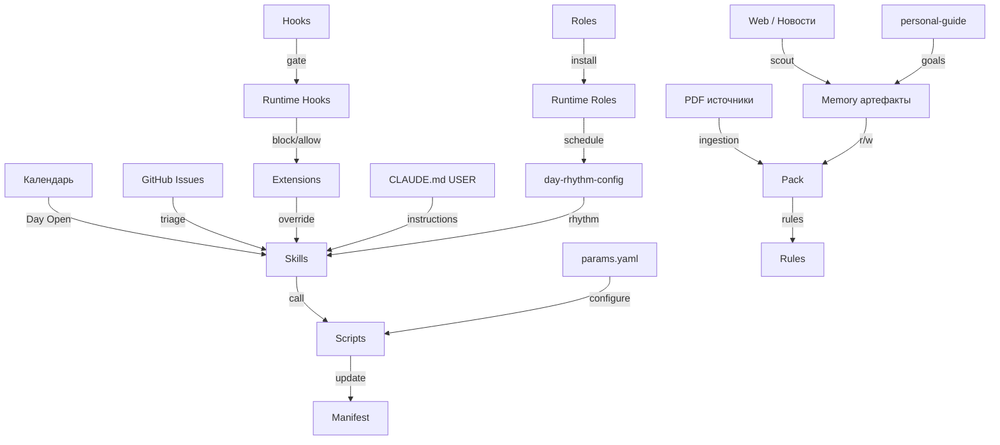
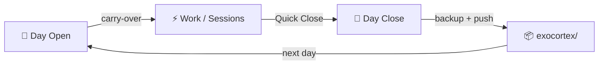
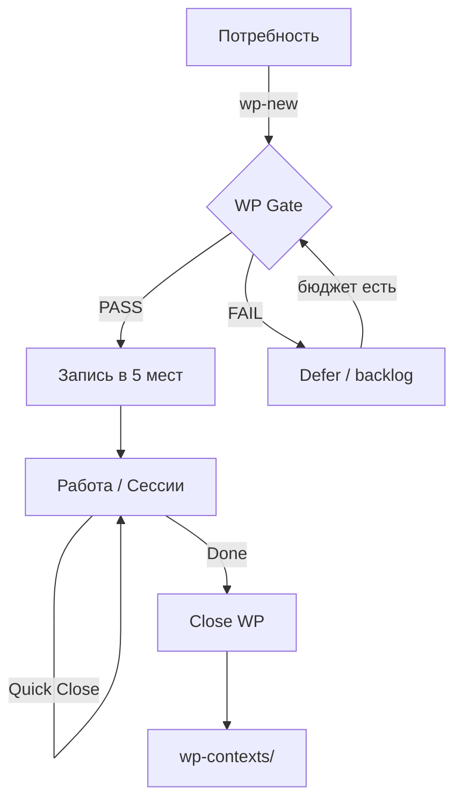
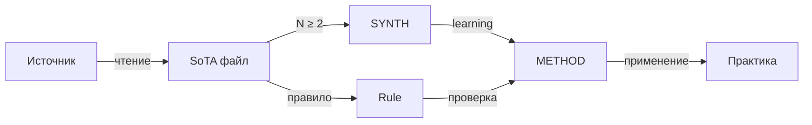
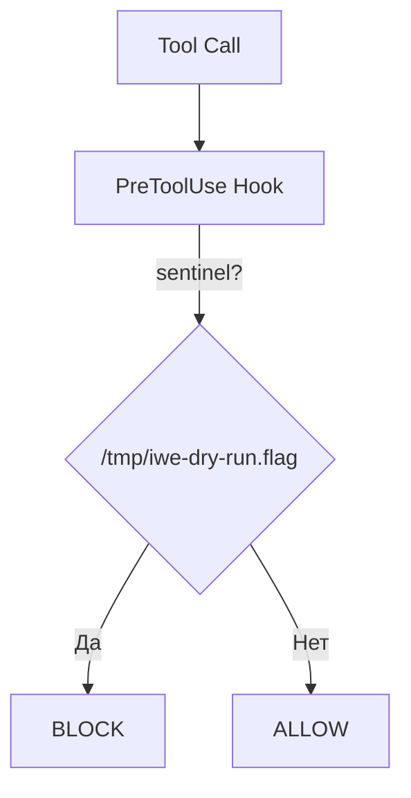
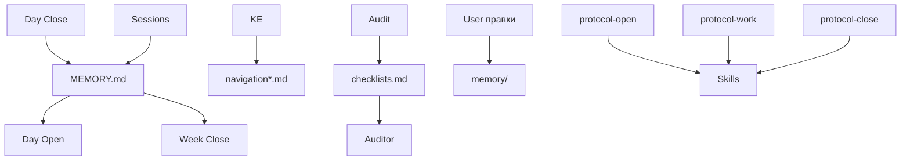
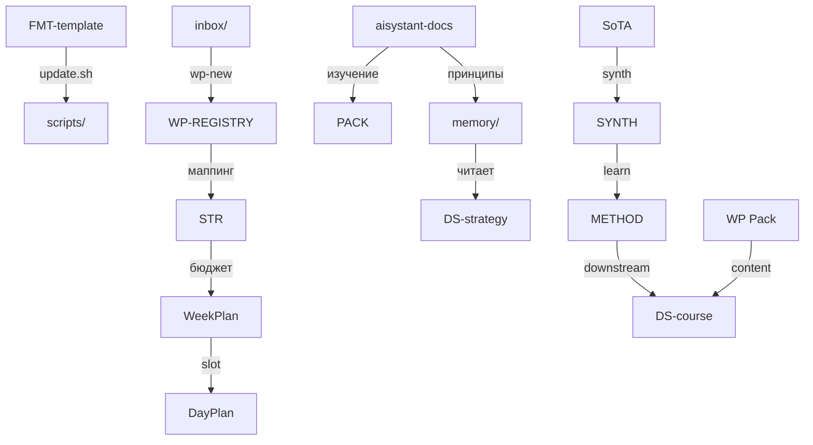

# 🧠 IWE Экзокортекс — Визуальная архитектура

**FMT:** 0.34.1 · **Дата:** 2026-05-24 · **Формат:** Markdown + Mermaid

---

## Легенда слоёв

| Слой | Маркер | Что это |
|------|--------|---------|
| L0 External | 🔴 | PDF, Web, календарь, GitHub |
| L1 Platform | 🟠 | Шаблон `FMT-exocortex-template` (не трогать руками) |
| L2 Runtime | 🟡 | `.iwe-runtime/` — подставленные пути, манифесты |
| L3 User | 🟢 | Расширения, память, паки — ваша зона |
| L4 Personal | 🔵 | USER-SPACE в `CLAUDE.md`, ритм дня, `personal-guide/` |

---

## 1. Общая архитектура

Потоки данных идут снизу вверх (L0→L1→L2→L3). Управляющие сигналы — сверху вниз (L4→L3→L1).

**Ключевые связи:**
- `CAL → SKILLS` — календарь запускает ритуал Day Open.
- `RT_HOOKS → EXT` — runtime решает «разрешить / заблокировать» по вашим расширениям.
- `PACKS → RULES` — знания из Pack становятся правилами системы.

---

## 2. Ритуальный цикл дня

**Day Open (6 шагов):**
1. Extensions (before)
2. Вчера: DayPlan + коммиты
3. Issues + Inbox Triage
4. План на сегодня (carry-over + WeekPlan)
5. IWE за ночь (`update.sh --check`)
6. Запись DayPlan + session-log

**Work / Sessions:**
- Работа по WP. После каждой сессии — **Quick Close** (коммиты, статус WP, уроки, next action).

**Day Close (9 шагов):**
1. Сбор коммитов
2. Governance batch (WeekPlan + WeekReport + WP-REGISTRY)
3. Архивация DayPlan
4. Memory Drift Scan
5. Index Health Check
6. Lesson Hygiene
7. Мультипликатор (WakaTime)
8. Итоги + 3 варианта завтра
9. Коммит + push

> **Принцип:** Day Open и Day Close — протоколы с обязательными шагами. Пропуск = потеря контекста. `exocortex/` — offline-архив, не в git.

---

## 3. Жизненный цикл WP

**5 мест записи (атомарно):**
1. `MEMORY.md` — РП текущей недели
2. `WP-REGISTRY.md` — реестр всех WP
3. `WeekPlan W{N}` — таблица РП
4. `Strategy.md` — РП → результат месяца
5. `inbox/WP-{N}-*.md` — context-файл

**WP Gate — блокеры:**
- Нет WeekPlan → СТОП
- Бюджет недели перегружен → предупреждение
- Open-ended WP → запрещены

---

## 4. SoTA Ingestion Pipeline

**Критическое правило (ArchGate):** `SYNTH = learning-only`. Правила пишутся только от **индивидуальных SoTA**, не от SYNTH. Защита от «controlled semantic coarsening».

**Структура SoTA-файла:**
- **Frontmatter:** id, type, trust, status
- **Key Claims:** с numeric confidence
- **Loss Notes:** что потеряно при сокращении
- **Source Links:** страницы / уравнения

**Правила SYNTH:**
- `rules_source: false` — SYNTH нельзя цитировать как основание правила
- **Weakest-link:** confidence = min(trust источников)
- **Freshness window:** старше 2 лет → auto-tag

---

## 5. Роли и агенты

| ID | Роль | FX | Кто исполняет | Задачи |
|----|------|-----|---------------|--------|
| R1 | **Стратег** | — | Скилл | Day Open/Close, Week Close, стратсессии, wp-new |
| R2 | **Экстрактор** | — | Скилл | KE в Pack, inbox, ontology sync, apply-captures |
| R5 | **Архитектор** | FX5 | Скилл + inline | ArchGate (7 критериев), ADR, FPF routing |
| R6 | **Кодировщик** | FX5, FX8 | Inline + скилл | Код, рефакторинг, iwe-update, audit |
| R23 | **Верификатор** | — | Sub-agent | Проверка по эталону. **Context isolation** |
| R24 | **Аудитор** | — | Sub-agent + скилл | 6 компонентов, verdict ✅/⚠️/❌ |
| R8 | **Синхронизатор** | — | Скрипт + скилл | update.sh, template-sync, drift, backup |
| R9 | **Шаблонизатор** | FX8 | Скилл | iwe-update, extend, pack-new |

> **Context isolation** (R23, R24): субагент не видит историю сессии. Оценивает только готовый артефакт.

---

## 6. Hooks — Gate-механика

**12 хуков в `.claude/hooks/`:**

| Хук | Что делает |
|-----|------------|
| `agent-trace-recorder` | Запись трассировки |
| `agent-trace-uploader` | Отправка трассировки |
| `capture-bus` | Маршрутизация captures |
| `close-gate-reminder` | Напоминание о Close |
| `dry-run-gate` | **Блокирует write при тесте** (TTL 10 мин) |
| `extensions-gate` | Проверка extensions |
| `precompact-checkpoint` | Чекпоинт перед compaction |
| `protocol-artifact-validate` | Валидация артефактов |
| `protocol-completion-reminder` | Напоминание о завершении |
| `protocol-stop-gate` | Остановка протокола |
| `wakatime-heartbeat` | Heartbeat каждые 2 мин (Kimi CLI) |
| `wp-gate-reminder` | Нет WP = СТОП |

---

## 7. Ключевые скрипты

| Скрипт | Триггер | Что делает | Куда пишет |
|--------|---------|------------|------------|
| `day-close.sh` | Day Close шаг 5 | Backup, MCP reindex, Linear sync | `exocortex/memory-*/`, Neon |
| `update.sh` | Вручную / Day Open | Синхронизация с FMT | `.claude/*`, `scripts/*`, `memory/*` |
| `iwe-audit.sh` | skill audit-installation | 6 компонентов | stdout → Auditor |
| `iwe-drift.sh` | audit шаг 2 | workspace vs FMT diff | stdout |
| `mcp-healthcheck.sh` | Вручную / audit | MCP endpoint check | stdout (latency + HTTP) |
| `kimi-wakatime-start.sh` | Day Open ext | Фоновый heartbeat | `.iwe-runtime/wakatime-kimi.pid` |
| `wp-sync-bundle.sh` | Day Open шаг 3 | Сбор контекста WP | `/tmp/wp-sync-bundle-*.md` |
| `extractor.sh` | Cron (R2) | Inbox check, KE, ontology | `inbox/captures.md`, `Pack/` |
| `strategist.sh` | Cron (R1) | Day Open, Week Close | `current/DayPlan*`, `MEMORY.md` |
| `scheduler.sh` | Cron (R8) | Code scan, daily report | `memory/*`, notifications |

---

## 8. Поток данных в memory/

**Гигиена памяти:**
- `MEMORY.md` — только активные РП (in_progress + pending). Done → архив на Week Close.
- Уроки — ≤8 штук. Старые (>1 недели) → `lessons_YYYY-MM.md`.
- Protocol-файлы — читаются скиллами, не правятся вручную.
- Navigation — карты маршрутизации, помогают решить «куда писать».

---

## 9. Репозитории и связи

**Потоки:**
- **FMT → SCRIPTS** — обновления шаблона через `update.sh`, 3-way merge сохраняет USER-SPACE.
- **INBOX → WP** — `wp-new` создаёт context-файл, который попадает в реестр.
- **STRAT → WEEK → DAY** — каскад планирования: месяц → неделя → день.
- **METHOD → COURSE** — методы Pack становятся лекциями и модулями.
- **DOCS → MEMORY** — изучение документации обогащает оперативную память.

---

## 10. Ключевые принципы

| # | Принцип | Суть | Нарушение = |
|---|---------|------|-------------|
| 1 | **L1 = Immutable** | FMT не правится руками. Кастомизации в L3. | Дрифт при update.sh |
| 2 | **WP Gate** | Нет WP в MEMORY.md → работа не начинается. | Инвентаризация, перегруз бюджета |
| 3 | **SYNTH ≠ Rules** | SYNTH — только обучение. Правила от индивидуальных SoTA. | Semantic coarsening |
| 4 | **Context Isolation** | Auditor/Verifier не видят историю сессии. | Оценка процесса вместо результата |
| 5 | **Atomic Writes** | wp-new = 5 мест за одну транзакцию. | Невалидный WP, дыры в реестре |
| 6 | **Dry-Run Contract** | Sentinel + dry-run-gate = безопасное тестирование. | Случайные write в проде |

---

## Рендер

- **Obsidian:** встроенный Mermaid (Settings → Core plugins).
- **GitHub / GitLab:** нативная поддержка Mermaid-блоков.
- **VS Code:** расширение *Markdown Preview Mermaid Support*.
- **Браузер:** HTML-версия — `memory/iwe-architecture-visual.html`.
