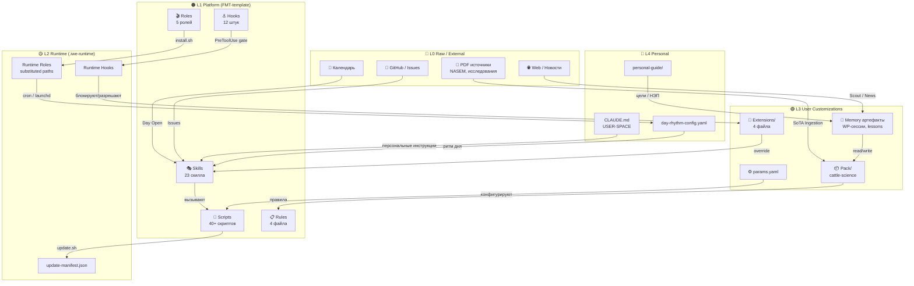
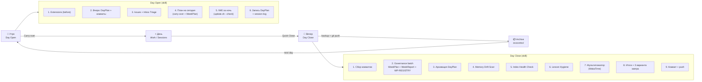
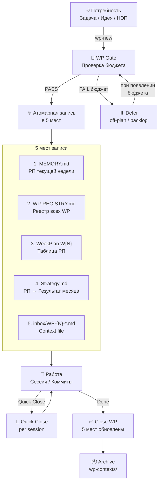
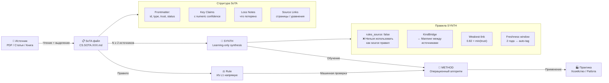
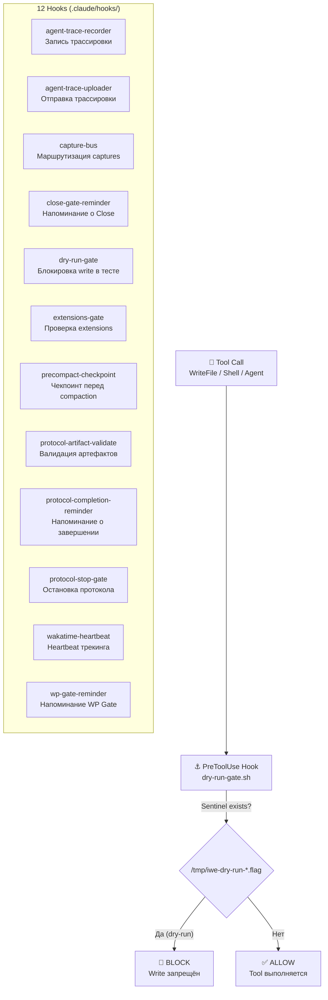
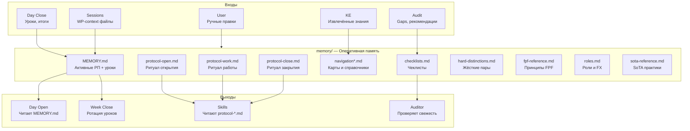
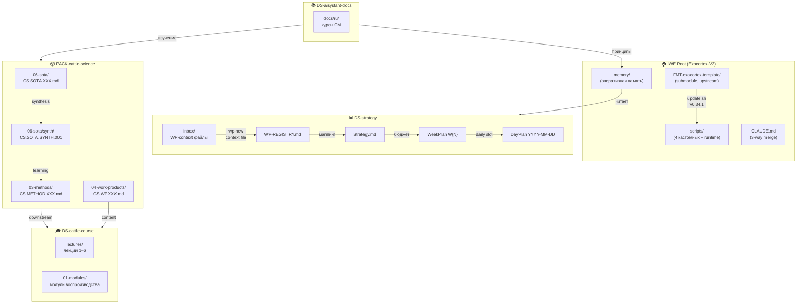

# 🧠 IWE Экзокортекс — Визуальная архитектура

**Версия:** FMT 0.34.1  
**Дата:** 2026-05-24  
**Формат:** Markdown + Mermaid (рендерится в Obsidian, GitHub, GitLab)

---

## Легенда слоёв

| Слой | Цвет | Назначение |
|------|------|------------|
| L0 Raw / External | 🔴 | Внешние источники: PDF, Web, календарь, GitHub |
| L1 Platform | 🟠 | Неизменяемый шаблон `FMT-exocortex-template`: скиллы, хуки, скрипты, правила |
| L2 Runtime | 🟡 | Генерируемый слой `.iwe-runtime/`: подставленные пути, runtime-роли, манифесты |
| L3 User Customizations | 🟢 | Пользовательские расширения: `extensions/`, `params.yaml`, память, паки |
| L4 Personal | 🔵 | Персональные настройки: USER-SPACE в `CLAUDE.md`, ритм дня, личное руководство |

---

## 1. Общая архитектура (L0–L4)

Эта диаграмма показывает, как пять слоёв экзокортекса стыкуются друг с другом.  
**Главный смысл:** потоки данных идут снизу вверх (L0 → L1 → L2 → L3), а управляющие сигналы — сверху вниз (L4 → L3 → L1). L1 никогда не правится руками — только через `update.sh`. Все персональные правки живут в L3–L4.

**Ключевые связи:**
- `CAL → SKILLS` — календарь триггерит ритуал Day Open через скилл.
- `RT_HOOKS → EXT` — хуки runtime принимают решение «разрешить / заблокировать» на основе пользовательских расширений.
- `PACKS → RULES` — знания из Pack (например, `cattle-science`) становятся правилами для всей системы.

---

## 2. Ритуальный цикл дня

Эта диаграмма описывает замкнутый цикл суточной работы.  
**Главный смысл:** Day Open и Day Close — это не просто заметки, а **протоколы** с обязательными шагами. Пропуск шага = риск потери контекста. Quick Close используется после каждой рабочей сессии, Day Close — в конце дня.

**Что происходит на каждом этапе:**
- **Day Open** — система собирает контекст (что было вчера, какие issues, что запланировано в WeekPlan), проверяет обновления шаблона и фиксирует DayPlan.
- **Work / Sessions** — собственно работа по WP. После каждой сессии — Quick Close (коммиты, статус WP, уроки, next action).
- **Day Close** — governance-штамповка: обновление реестров, архивация, проверка здоровья индекса, time-tracking и план на завтра.
- **exocortex/** — offline-архив состояния памяти на конец дня. Не попадает в git.

---

## 3. Жизненный цикл Рабочего Продукта (WP)

Эта диаграмма показывает, как рождается, живёт и закрывается задача.  
**Главный смысл:** нельзя просто «взять и сделать». Любая работа проходит через **WP Gate** — проверку бюджета и наличия WeekPlan. Затем — **атомарная запись в 5 мест** (одна транзакция, нельзя пропустить место). Quick Close внутри сессии позволяет фиксировать прогресс без ожидания финала.

**WP Gate — блокеры:**
- Нет WeekPlan → СТОП.
- Бюджет недели перегружен → предупреждение.
- Open-ended WP (без чёткого результата) → запрещены.

**Quick Close фиксирует:**
- Коммиты за сессию.
- Статус WP (partial / done).
- Уроки (≤8 штук в MEMORY.md).
- Следующий шаг (next action).

---

## 4. SoTA Ingestion Pipeline

Эта диаграмма описывает путь от источника знаний до операционного метода.  
**Главный смысл:** существует два потока — **SoTA** (индивидуальные извлечения из источников) и **SYNTH** (синтез из ≥2 источников). Критическое архитектурное решение (ArchGate): **SYNTH = learning-only**. Правила пишутся только от индивидуальных SoTA (L1), не от SYNTH (L2). Это предотвращает «controlled semantic coarsening» — когда усреднение разных источников маскирует важные нюансы.

**Структура SoTA-файла:**
- **Frontmatter** — идентификатор, тип доверия (научный / экспертный / анекдот), статус.
- **Key Claims** — ключевые утверждения с числовым confidence (0.0–1.0).
- **Loss Notes** — честная запись о том, что потеряно при сокращении.
- **Source Links** — точные страницы, уравнения, таблицы для верификации.

**Правила SYNTH:**
- `rules_source: false` — SYNTH нельзя цитировать как основание правила.
- **Weakest-link** — итоговый confidence синтеза равен минимальному среди источников.
- **Freshness window** — источники старше 2 лет автоматически помечаются.

---

## 5. Роли (Agents) и их функции

Эта таблица описывает 8 ключевых ролей экзокортекса.  
**Главный смысл:** каждая роль — это не просто название, а контракт с чёткими полномочиями. Роли R1 и R2 — стратег и экстрактор — управляют потоками работы и знаний. R23 (Верификатор) и R24 (Аудитор) работают в режиме **context isolation**: они не видят историю сессии, а оценивают только готовый артефакт. Это защита от предвзятости.

| ID | Роль | FX | Исполнитель | Типичные задачи |
|----|------|-----|-------------|-----------------|
| R1 | **Стратег** | — | Скилл | Day Open/Close, Week Close, стратсессии, wp-new, run-protocol |
| R2 | **Экстрактор** | — | Скилл | KE в Pack, inbox check, ontology sync, apply-captures |
| R5 | **Архитектор** | FX5 | Скилл + inline | ArchGate (7 критериев ЭМОГССБ), ADR, FPF routing |
| R6 | **Кодировщик** | FX5, FX8 | Inline + скилл | Код, рефакторинг, iwe-update, audit-installation |
| R23 | **Верификатор** | — | Sub-agent | Проверка артефактов по эталону. Context isolation |
| R24 | **Аудитор** | — | Sub-agent + скилл | audit-installation: 6 компонентов, verdict ✅/⚠️/❌ |
| R8 | **Синхронизатор** | — | Скрипт + скилл | update.sh, template-sync, drift detection, backup |
| R9 | **Шаблонизатор** | FX8 | Скилл | iwe-update, extend, pack-new |

**Обозначения:**
- **FX** — функциональные требования (FX5 = архитектурные, FX8 = шаблонные).
- **Context isolation** — субагент получает только артефакт и эталон, без истории переписки.

---

## 6. Hooks — Gate-механика

Эта диаграмма показывает, как работает перехват инструментов (PreToolUse hook).  
**Главный смысл:** перед выполнением любого write-инструмента (WriteFile, Shell, Agent) система проверяет sentinel-файл. Если найден флаг dry-run — операция блокируется. Это позволяет делать audit и smoke-test без риска случайно изменить файлы.

**Три ключевых хука:**

| Хук | Назначение |
|-----|------------|
| **dry-run-gate.sh** | Блокирует write-tools при наличии sentinel-файла. TTL: 10 мин (защита от `kill -9`). |
| **wp-gate-reminder.sh** | Проверяет наличие WP в MEMORY.md перед началом работы. Нет WP = СТОП. |
| **wakatime-heartbeat.sh** | Отправляет heartbeat в WakaTime каждые 2 минуты при работе в Kimi CLI. |

---

## 7. Ключевые скрипты — что куда записывает

Эта таблица описывает 10 основных скриптов и их роль в конвейере.  
**Главный смысл:** каждый скрипт — это автоматизация рутинной операции, которую иначе пришлось бы делать вручную и рисковать забыть шаг. Скрипты разделены по ролям: стратег (`strategist.sh`), экстрактор (`extractor.sh`), синхронизатор (`scheduler.sh`).

| Скрипт | Когда запускается | Что делает | Куда пишет |
|--------|-------------------|------------|------------|
| `day-close.sh` | Day Close (шаг 5) | Backup memory/, MCP reindex, Linear sync | `exocortex/memory-*/`, domain_event (Neon) |
| `update.sh` | Вручную / Day Open check | Синхронизация с FMT-exocortex-template | `.claude/*`, `scripts/*`, `memory/*` (selective) |
| `iwe-audit.sh` | audit-installation skill | Проверка 6 компонентов инсталляции | stdout (отчёт для Аудитора) |
| `iwe-drift.sh` | audit-installation (шаг 2) | Сравнение workspace vs FMT | stdout (diff report) |
| `mcp-healthcheck.sh` | Вручную / audit | Проверка MCP endpoint с Bearer token | stdout (latency + HTTP codes) |
| `kimi-wakatime-start.sh` | Day Open (extension) | Запуск фонового heartbeat | `.iwe-runtime/wakatime-kimi.pid` |
| `wp-sync-bundle.sh` | Day Open (шаг 3) | Сбор контекста WP + связанных | `/tmp/wp-sync-bundle-*.md` |
| `extractor.sh` | Cron / launchd (R2) | Inbox check, KE, ontology sync | `inbox/captures.md`, `Pack/` |
| `strategist.sh` | Cron / launchd (R1) | Day Open, Week Close, note-review | `current/DayPlan*`, `MEMORY.md` |
| `scheduler.sh` | Cron / launchd (R8) | Code scan, daily report, notify | `memory/*`, notifications |

**Как читать таблицу:**
- **Cron / launchd** — скрипты сидят в фоне и запускаются по расписанию, не требуя вмешательства.
- **stdout** — результат идёт прямо в консоль, откуда его подхватывает субагент (Аудитор или пользователь).
- **Selective** — `update.sh` обновляет только те файлы, которые помечены в манифесте; пользовательские правки в L3 не затираются.

---

## 8. Поток данных в memory/

Эта диаграмма показывает, как информация попадает в оперативную память и как оттуда читается.  
**Главный смысл:** `memory/` — это не просто папка с заметками, а **оперативная память экзокортекса**. Она должна оставаться компактной: MEMORY.md хранит только активные РП (in_progress + pending), done-РП удаляются на Week Close. Уроки ограничены восемью штуками; старые (>1 недели без применения) архивируются в `lessons_YYYY-MM.md`.

**Правила гигиены памяти:**
- **MEMORY.md** — только активные РП. Done → архив.
- **Уроки** — ≤8 штук. Старые (>1 недели без применения) → `lessons_YYYY-MM.md`.
- **Protocol-файлы** — читаются скиллами при вызове run-protocol. Не меняются вручную — только через template-sync.
- **Navigation** — карты маршрутизации (например, `routing-vocab.md`), помогают скиллам определять куда писать новые знания.

---

## 9. Репозитории и их связи

Эта диаграмма показывает экосистему репозиториев вокруг IWE.  
**Главный смысл:** IWE — это хаб (root), который связывает стратегию (`DS-strategy`), предметные знания (`PACK-cattle-science`), обучение (`DS-cattle-course`) и внешнюю документацию (`DS-aisystant-docs`). Связи идут через git submodules и через логические потоки: бюджет из Strategy → WeekPlan → DayPlan, контент из Pack → Course, принципы из Docs → Memory.

**Ключевые потоки:**
- **FMT → SCRIPTS** — `update.sh` тянет обновления шаблона в рабочую директорию. 3-way merge сохраняет USER-SPACE.
- **INBOX → WP** — при создании WP через `wp-new` контекстный файл помещается в `inbox/`, оттуда он попадает в реестр.
- **STRAT → WEEK → DAY** — каскад планирования: стратегия месяца → бюджет недели → слоты дня.
- **METHOD → Course** — методы из Pack становятся содержанием курса (лекции и модули).
- **Docs → MEMORY** — изучение внешней документации обогащает оперативную память (hard-distinctions, principles).

---

## 10. Ключевые принципы (чеклист понимания)

Этот раздел собирает 6 архитектурных правил в формате «что / зачем / следствие».  
**Главный смысл:** если вы понимаете эти 6 принципов, вы понимаете 80% того, как работает IWE. Нарушение любого из них приводит к известным anti-patterns: дрифту инсталляции, неконтролируемому росту MEMORY.md, смешению слоёв L1/L3.

### 1. L1 = Immutable
**Что:** `FMT-exocortex-template` никогда не правится руками. **Зачем:** смешение слоёв = хрупкость при обновлении. Пользовательские правки живут в L3 (`extensions/`, `params.yaml`). L1 обновляется только через `update.sh`.

### 2. WP Gate = Блокер
**Что:** Нет WP в MEMORY.md → работа не начинается. **Зачем:** предотвращает «инвентаризацию» — накопление незавершённых задач без учёта бюджета. Нет бюджета в WeekPlan → предупреждение.

### 3. SYNTH ≠ Rules
**Что:** SYNTH — только для обучения. Правила пишутся от **индивидуальных SoTA**. **Зачем:** защита от «controlled semantic coarsening». Усреднение разных источников маскирует важные нюансы. ArchGate обязателен для любого архитектурного решения.

### 4. Context Isolation
**Что:** Аудитор (R24) и Верификатор (R23) — субагенты **без истории сессии**. **Зачем:** если субагент видит, как артефакт создавался, он оценивает процесс, а не результат. Isolation гарантирует чистую проверку по эталону.

### 5. Atomic Writes
**Что:** `wp-new` = запись в 5 мест **атомарно**. **Зачем:** пропуск места = невалидный WP. Например, WP есть в WeekPlan, но нет в WP-REGISTRY → система не найдёт его при аудите.

### 6. Dry-Run Contract
**Что:** Sentinel-файл (`/tmp/iwe-dry-run-*.flag`) + `dry-run-gate.sh` = безопасное тестирование. **Зачем:** позволяет запускать протоколы (Day Close, Week Close) в режиме проверки без риска случайно записать что-то в файлы или базу данных.

---

## Как использовать этот документ

- **Obsidian:** Mermaid-диаграммы рендерятся нативно через плагин Mermaid Tools.
- **GitHub / GitLab:** Поддержка Mermaid в Markdown включена по умолчанию.
- **VS Code:** Используйте расширение Markdown Preview Mermaid Support.
- **Печать:** Экспортируйте через Pandoc или откройте HTML-версию (`memory/iwe-architecture-visual.html`) в браузере.
